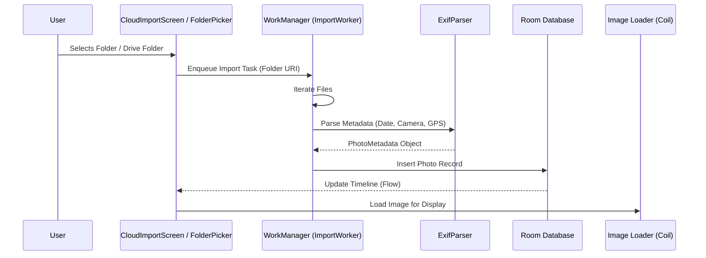
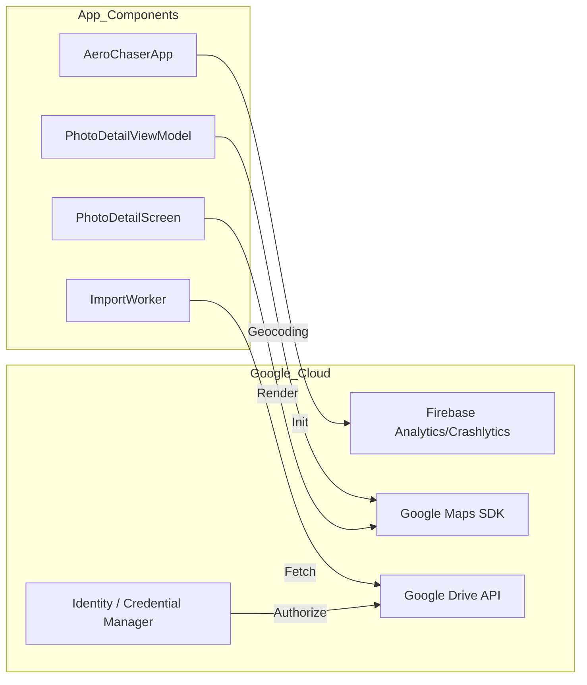

# AeroChaser Architecture & Workflow Visualization

This document provides a visual guide to the application's structure and how data flows through the system.

## 1. High-Level Architecture (Clean Architecture)
AeroChaser follows a strict Layered Architecture to ensure that business logic is independent of the UI and data sources.

```mermaid
graph TD
    subgraph Presentation_Layer["Presentation Layer (Jetpack Compose)"]
        UI[UI Screens / Composables]
        VM[ViewModels (StateFlow)]
    end

    subgraph Domain_Layer["Domain Layer (Pure Kotlin)"]
        UC[Use Cases]
        Model[Domain Models (PhotoMetadata, GearProfile)]
        RepoInt[Repository Interfaces]
    end

    subgraph Data_Layer["Data Layer (Android/Cloud)"]
        RepoImpl[Repository Implementations]
        Room[Room Database (Local Cache)]
        LocalSrc[Local File System (SAF)]
        CloudSrc[Google Drive & Photos API]
    end

    UI --> VM
    VM --> UC
    UC --> RepoInt
    RepoImpl -- implements --> RepoInt
    RepoImpl --> Room
    RepoImpl --> LocalSrc
    RepoImpl --> CloudSrc
```

---

## 2. Photo Import Workflow
This diagram shows how a photo is processed from a directory (Local or Cloud) into the app's timeline.



---

## 3. Google Services Integration Map
How the newly added Google Services connect to the existing app components.



---

## 4. Component Directory Map
| Component | Package Path | Responsibility |
|---|---|---|
| **Entry Point** | `com.aerochaser.AeroChaserApp` | Firebase Init, Koin Setup |
| **Main Timeline** | `presentation.timeline` | Scrolling Grid of Photos |
| **Detail View** | `presentation.detail` | Zoomable Photo + **Google Maps** |
| **Cloud Logic** | `data.cloud` | **GoogleDrivePhotoSource** |
| **Metadata Engine** | `data.local.exif` | Reading EXIF headers |
| **Sync Engine** | `data.local.worker` | **ImportWorker** (Background Processing) |

---
**Tip**: Use these diagrams to explain the system to new developers during the onboarding phase.
